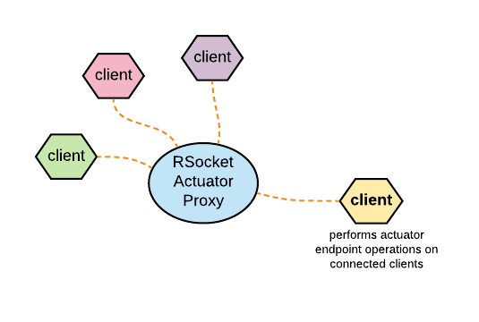

## Spring Boot RSocket Actuator Proxy

##### To obtain actuator management endpoints from ensemble of connected clients via a proxy



The idea is to reach out and collect actuator management endpoints from 
all instances of a particular microservice (or probably instances of ALL services).

### On Spring boot microservice client

provided your service has the `spring-boot-starter-rsocket` and `spring-boot-starter-actuator` dependencies, add
the following proxy client starter dependency:

```xml
<dependency>
    <groupId>io.agilehandy</groupId>
    <artifactId>actuator-proxy-client-spring-boot-starter</artifactId>
    <version>{version}</version>
</dependency>
```

add the following properties to your `application.yaml` to connect to a proxy,
specify a service name, and (temporary for now) define the exposed endpoints to be as the 
same as the ones that you exposed by your managed actuator.

```yaml
management:
  rsocket:
    client:
      service-name: ${spring.application.name}
      endpoints:
        exposure:
          include: ${management.endpoints.web.exposure.include}
      proxy:
        host: localhost
        port: 7002
```

Another client (with a typical setup) can obtain a collection of the health from
all connected clients or from those of a specific service. To do that you can inject and use 
the `ActuatorProxyClient` bean as follows:

```java
@Component
class MyClass {
    private final ActuatorProxyClient proxyClient;

    public MyClass(ActuatorProxyClient proxyClient) {
        this.proxyClient = proxyClient;
    }

    public void readHealth() {
    // create a read operation request object
    ActuatorReadRequest readRequest = new ActuatorReadRequest.Builder()
        .withRoute("actuator.health.read")  // route formed from: baseRoot.endpointId.option (where baseRoot has a value of actuator)
        .build();

    // use the proxy client to read connected actuator health
    proxyClient.read(readRequest)
        .doOnNext(System.out::println)
        .subscribe(); 
    }
   
}
```

You can view all mapped routes to actuator endpoints logged out 
setting `logging.level.io.agilehandy.actuator.rsocket.client` in your properties file.

endpoint route format is: `baseRoot.endpointId.operation.[parameter-name *]`
where baseRoot defaults to a value of `actuator`

for example: 
*   to read a client health the route would look like `actuator.health.read`
*   to read a client health by path name parameter, the route would look like: `actuator.health.read.name`. The parameter name
and value would be passed via the request object.

####### In-Progress
*   Beside the read `ActuatorReadRequest`, there are also `ActuatorWriteRequest` and `ActuatorDeleteRequest` domain objects 
by which you can perform proxied read and write operation on connected clients. All these operation request domain objects
can optionally include any operation parameters. 

*   Potential use is to leverage this mechanism to refresh configuration of all connected instances of 
a specific microservice.

### Actuator Proxy

I am putting a docker image together to publish. Meanwhile, you can run the main class on the `proxy-server` sub-module.
The proxy would run on port 7002.


